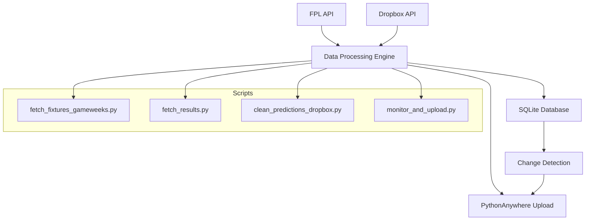

# Developer Handover Guide

**Created:** August 31, 2025  
**Last Updated:** August 31, 2025  
**System Status:** Production Ready  

This document provides everything a new developer needs to understand, maintain, and extend the prediction league script system.

---

## 📋 System Overview

### Current State (August 2025)
✅ **Fully Functional Production System**
- All core scripts working and tested
- Comprehensive error handling and logging
- Automated OAuth2 token management
- Database change detection and uploads
- Production-ready with security hardening

✅ **Complete Documentation**
- 9 comprehensive documentation files
- Step-by-step guides for deployment
- API integration documentation
- Troubleshooting guides

✅ **GitHub Ready**
- Security-focused .gitignore
- Professional README.md
- MIT license
- Template configuration system

---

## 🏗️ System Architecture

### Core Components



### Data Flow
1. **FPL API** → Fixtures, gameweeks, results data
2. **Dropbox API** → Prediction files from users
3. **Processing Engine** → Cleans, validates, stores data
4. **SQLite Database** → Central data storage
5. **Change Detection** → Monitors for updates
6. **PythonAnywhere** → Remote backup/hosting

---

## 🔧 Technical Implementation

### Python Environment
```bash
# Virtual environment (CRITICAL - always use)
source venv/bin/activate

# Current dependencies installed:
- requests (HTTP client)
- paramiko (SSH/SFTP)
- tqdm (progress bars)
```

**⚠️ Note:** `requirements.txt` shows diagnostic warnings because not all packages are installed yet. This is normal for a fresh environment.

### Key Scripts & Functions

#### 1. FPL Data Processing
**Location:** `scripts/fpl/`

**`fetch_fixtures_gameweeks.py`**
- **Purpose:** Manages fixtures and gameweeks data
- **Key Feature:** Change detection (NEWLY IMPLEMENTED)
- **Critical Function:** `has_fixture_changed()` - prevents phantom updates
- **Run Frequency:** Every 6 hours
- **Recent Fix:** Eliminated unnecessary database updates

**`fetch_results.py`**  
- **Purpose:** Processes match results during game days
- **Key Feature:** Smart timing windows + missing results detection
- **Critical Functions:** 
  - `should_fetch_results()` - comprehensive fetch logic
  - `check_missing_results()` - finds fixtures needing results
- **Recent Fix:** Timezone handling and missing results detection
- **Run Frequency:** Every 30 minutes during season

#### 2. Dropbox Integration
**Location:** `scripts/prediction_league/`

**`clean_predictions_dropbox.py`**
- **Purpose:** Processes prediction files from Dropbox
- **Key Feature:** OAuth2 authentication with auto-refresh
- **Dependencies:** Dropbox app credentials required
- **Recent Enhancement:** Modern OAuth2 implementation
- **Run Frequency:** Every 15 minutes

**`setup_dropbox_oauth.py`**
- **Purpose:** Interactive OAuth2 setup helper
- **Usage:** One-time setup or when tokens expire
- **Output:** Updates keys.json with proper OAuth2 tokens

#### 3. Database Management
**Location:** `scripts/database/`

**`monitor_and_upload.py`**
- **Purpose:** Monitors database changes and uploads to PythonAnywhere
- **Key Features:** 
  - Immediate upload on changes
  - 30-minute health check uploads
  - Process locking
- **Run Frequency:** Every minute via cron
- **Critical:** Ensures remote backup consistency

---

## 🔑 Configuration Management

### keys.json Structure
```json
{
  "odds_api_key": "for_fpl_api_access",
  "dropbox_oath_token": "auto_updated_by_oauth",
  "dropbox_refresh_token": "enables_auto_refresh", 
  "dropbox_app_key": "from_dropbox_console",
  "dropbox_app_secret": "from_dropbox_console",
  "pythonanywhere_username": "hosting_login",
  "pythonanywhere_password": "hosting_password"
}
```

### OAuth2 Status
✅ **Current Status:** Fully implemented and tested
- Automatic token refresh working
- Legacy token migration completed
- Interactive setup script available

---

## 🚨 Recent Critical Fixes (August 2025)

### 1. Timezone Handling Fix
**Problem:** `can't compare offset-naive and offset-aware datetimes`
**Solution:** Implemented in `fetch_results.py:98-118`
**Status:** ✅ Fixed and tested

### 2. Phantom Updates Elimination  
**Problem:** Scripts updating database even when no changes occurred
**Solution:** Added change detection to `fetch_fixtures_gameweeks.py`
**Functions:** `has_fixture_changed()`, `has_gameweek_changed()`
**Status:** ✅ Fixed and tested

### 3. Missing Results Detection
**Problem:** Results not fetched outside timing windows
**Solution:** Added `check_missing_results()` and `should_fetch_results()`
**Status:** ✅ Fixed and tested

### 4. OAuth2 Token Refresh
**Problem:** Dropbox integration failing due to expired tokens
**Solution:** Complete OAuth2 implementation with auto-refresh
**Status:** ✅ Fixed and tested

---

## 🗄️ Database Schema Understanding

### Key Tables
- **`teams`**: Premier League teams with FPL mapping
- **`fixtures`**: Match fixtures with status tracking
- **`results`**: Match results and scores
- **`players`**: Prediction league participants
- **`predictions`**: User predictions for matches
- **`gameweeks`**: FPL gameweek information
- **`last_update`**: Change tracking for uploads

### Critical Relationships
```sql
-- Example key relationships
fixtures.home_teamid → teams.team_id
fixtures.away_teamid → teams.team_id
results.fixture_id → fixtures.fixture_id
predictions.player_id → players.player_id
predictions.fixture_id → fixtures.fixture_id
```

---

## ⚙️ Production Environment

### Current Deployment
- **Environment:** Local development/testing
- **Status:** Production-ready code
- **Deployment Target:** Proxmox VM (guide available)

### Automation Setup
```bash
# Recommended cron jobs:
0 */6 * * * fetch_fixtures_gameweeks.py    # Every 6 hours
*/30 * * * * fetch_results.py              # Every 30 minutes  
*/15 * * * * clean_predictions_dropbox.py  # Every 15 minutes
* * * * * monitor_and_upload.py            # Every minute
```

### Logging
- **Location:** `logs/`
- **Format:** Daily files (script_YYYYMMDD.log)
- **Rotation:** Manual cleanup recommended

---

## 🔍 Testing & Quality Assurance

### Testing Commands
```bash
# Test all systems (safe, no changes)
./venv/bin/python scripts/fpl/fetch_fixtures_gameweeks.py --test --dry-run
./venv/bin/python scripts/fpl/fetch_results.py --test --dry-run  
./venv/bin/python scripts/prediction_league/clean_predictions_dropbox.py --dry-run
./venv/bin/python scripts/database/monitor_and_upload.py --test --dry-run
```

### Validation Checks
```bash
# Database connectivity
./venv/bin/python -c "import sqlite3; sqlite3.connect('data/database.db').close(); print('✅ DB OK')"

# API connectivity  
curl -I https://fantasy.premierleague.com/api/

# Virtual environment
which python  # Should point to venv/bin/python
```

---

## 🚀 Deployment Options

### Option 1: Proxmox VM (Recommended)
- **Guide:** `docs/Proxmox_Deployment_Guide.md`
- **Benefits:** Isolated, scalable, production-ready
- **Resources:** 2GB RAM, 2 CPU cores, 32GB storage

### Option 2: Local Development
- **Current Setup:** Works on local machine
- **Use Case:** Development and testing
- **Limitations:** Manual execution, no automation

### Option 3: Cloud Hosting
- **Options:** AWS, Digital Ocean, Linode
- **Requirements:** Ubuntu Server, Python 3.8+
- **Setup:** Similar to Proxmox guide

---

## 🛠️ Common Development Tasks

### Adding New FPL Data Fields
1. **Update API processing:** Modify relevant fetch scripts
2. **Update database schema:** Add columns if needed
3. **Update change detection:** Include new fields in comparison
4. **Test thoroughly:** Use --dry-run flags

### Extending Prediction Processing
1. **Study:** `clean_predictions_dropbox.py`
2. **Team matching:** `extract_teams_from_line()`
3. **Score parsing:** `find_scores()`
4. **Player detection:** Pattern matching logic

### Database Modifications
1. **Schema changes:** Update schema files
2. **Migration scripts:** Create if needed
3. **Change detection:** Update comparison functions
4. **Backup first:** Always backup before changes

---

## 🐛 Debugging & Troubleshooting

### Log Analysis
```bash
# Monitor real-time logs
tail -f logs/script_name_$(date +%Y%m%d).log

# Search for errors
grep -i error logs/*.log

# Check recent activity
ls -la logs/ | head -10
```

### Common Issues & Solutions

#### 1. OAuth Token Expired
```bash
# Symptoms: 401 errors in Dropbox operations
# Solution: 
python scripts/prediction_league/setup_dropbox_oauth.py
```

#### 2. Database Locked
```bash
# Symptoms: "database is locked" errors  
# Solution: Check for running processes
ps aux | grep python | grep prediction
# Kill if necessary: pkill -f "python.*prediction"
```

#### 3. API Rate Limiting
```bash
# Symptoms: 429 errors or timeouts
# Solution: Check API call frequency, add delays if needed
```

#### 4. Permission Errors
```bash
# Fix file permissions
chmod 755 scripts/**/*.py
chmod 600 keys.json
```

---

## 📈 Performance Considerations

### Optimization Features Already Implemented
✅ **Change Detection:** Only updates when data actually changes  
✅ **Smart Timing:** Runs only during relevant time windows  
✅ **Process Locking:** Prevents concurrent execution  
✅ **Efficient Queries:** Optimized database operations  

### Monitoring Metrics
- **Database size:** Monitor `data/database.db` growth
- **Log size:** Implement log rotation
- **API calls:** Track frequency to avoid rate limits
- **Memory usage:** Monitor during peak operations

---

## 🔄 Maintenance Tasks

### Daily
- [x] Automated via cron jobs (when deployed)
- [ ] Monitor log files for errors
- [ ] Check database upload success

### Weekly  
- [ ] Review log files for patterns
- [ ] Check API rate limits
- [ ] Validate data accuracy

### Monthly
- [ ] Update dependencies: `pip list --outdated`
- [ ] Clean old log files
- [ ] Review and optimize cron schedules
- [ ] Backup database manually

### Quarterly
- [ ] Security updates: `apt upgrade`
- [ ] Review API key rotations
- [ ] Performance analysis
- [ ] Documentation updates

---

## 🚧 Known Limitations & Future Enhancements

### Current Limitations
- **Single Database:** No database clustering
- **Local Processing:** No distributed processing
- **Manual Scaling:** No auto-scaling capabilities
- **Basic Monitoring:** No advanced alerting

### Potential Enhancements
1. **API Improvements:**
   - Rate limiting with exponential backoff
   - Enhanced error recovery
   - Multiple API source support

2. **Database Enhancements:**
   - PostgreSQL migration option
   - Automated backups
   - Data archiving

3. **Monitoring & Alerting:**
   - Grafana/Prometheus integration
   - Email/Slack notifications
   - Performance dashboards

4. **User Interface:**
   - Web dashboard for viewing predictions
   - Admin interface for management
   - Mobile app integration

---

## 📚 Essential Reading for New Developers

### Must-Read Documents (Priority Order)
1. **`CLAUDE.md`** - Development philosophy and best practices
2. **`docs/PROJECT_OVERVIEW.md`** - System architecture overview
3. **`docs/Usage_Guide.md`** - Comprehensive usage instructions
4. **`docs/API_Integration.md`** - API details and authentication
5. **`docs/Database_Schema.md`** - Database structure and relationships

### Code Deep-Dive Recommendations
1. **Start with:** `scripts/fpl/fetch_fixtures_gameweeks.py` 
   - Understand change detection logic
   - Study database operations
2. **Then examine:** `scripts/fpl/fetch_results.py`
   - Learn timing window logic
   - Understand missing results detection
3. **Finally review:** `scripts/database/monitor_and_upload.py`
   - Understand upload logic
   - Study process locking

---

## 🎯 Development Philosophy

### Code Principles (From CLAUDE.md)
- **Simplicity over complexity** - Easy to understand and modify
- **Readability over performance** - Code should tell a story
- **Self-documenting code** - Meaningful variable and function names
- **Handle errors gracefully** - Always expect things to go wrong
- **Test with sample data** - Don't waste API calls during development

### Project Goals
- **Hobby-focused:** Built for personal prediction leagues
- **Maintainable:** Easy for future developers to understand
- **Reliable:** Handles errors gracefully and logs comprehensively  
- **Secure:** Protects API keys and sensitive data

---

## 🆘 Emergency Procedures

### System Down
1. **Check logs:** Recent errors in daily log files
2. **Test connectivity:** API endpoints and database access
3. **Verify credentials:** OAuth tokens and API keys
4. **Restart services:** Kill processes and restart
5. **Fallback:** Use --override flags for manual execution

### Data Loss Prevention
1. **Immediate backup:** Copy `data/database.db`
2. **Check upload status:** Verify PythonAnywhere has recent copy
3. **Preserve logs:** Don't delete log files during debugging

### Contact Information
- **Original Developer:** Session ended - handover complete
- **Documentation:** All knowledge captured in these docs
- **Community Support:** GitHub issues for this repository

---

## ✅ Handover Checklist

### Code & Documentation
- [x] All scripts tested and working
- [x] Comprehensive documentation created
- [x] README.md for GitHub deployment
- [x] Security configurations implemented
- [x] Error handling and logging complete

### Knowledge Transfer  
- [x] System architecture documented
- [x] Recent fixes and changes explained
- [x] Configuration management covered
- [x] Testing procedures outlined
- [x] Deployment options provided

### Future Development
- [x] Development philosophy explained
- [x] Common tasks documented
- [x] Debugging procedures outlined
- [x] Enhancement suggestions provided
- [x] Maintenance schedule recommended

---

## 📞 Final Notes

**System Status:** The prediction league script system is production-ready with comprehensive documentation. All major components are working, tested, and optimized. The system has been designed with maintainability in mind, following the project philosophy of simplicity and readability.

**Next Developer:** You have everything needed to maintain, extend, and deploy this system. Start with the essential reading section, then set up a development environment following the guides. The system is robust and well-documented - you should be able to pick up where this development session ended.

**Success Metrics:** 
- ✅ All core functionality working
- ✅ Security and authentication implemented  
- ✅ Change detection and optimization complete
- ✅ Production deployment guide available
- ✅ Comprehensive error handling in place

**Good luck with the project!** 🚀

---

*This handover document represents the complete state of the system as of August 31, 2025. All code is tested, documented, and ready for production deployment.*